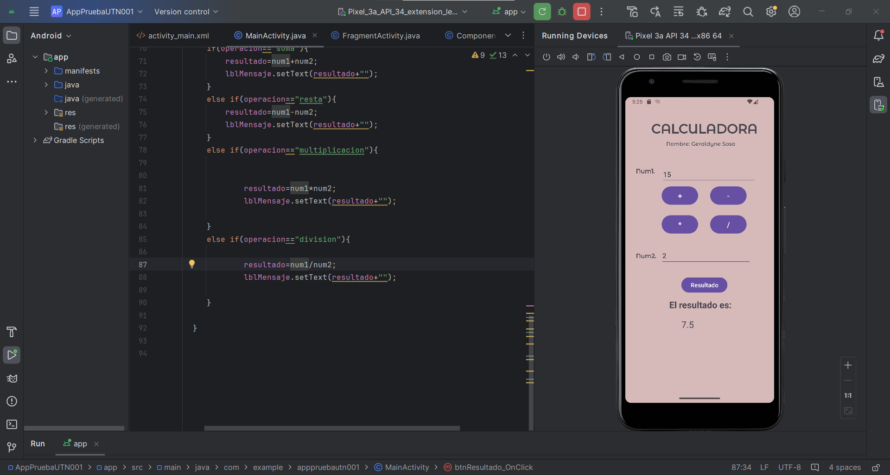

# Universidad Técnica del Norte - Calculadora Básica

**Nombre:** Geraldyne Nathaly Sosa Mediavilla  
**Materia:** Aplicaciones Móviles  
**Docente:** MSc. Diego Trejo  

Este es un proyecto de una calculadora básica para Android, realizada como parte de la asignatura de Aplicaciones Móviles en la Universidad Técnica del Norte.

## Características

- Realizar operaciones básicas como suma, resta, multiplicación y división.
- Introducir dos números y seleccionar la operación deseada.
- Obtener resultados con solo presionar un botón.

## Capturas de Pantalla

Aquí hay algunas capturas de pantalla de la aplicación en acción:

*Interfaz principal de la Calculadora*

*Ingreso de datos*

*Realizando una suma*

*Realizando una resta*

*Realizando una multiplicación*

*Realizando una división*

## Cómo Usar

Para usar la calculadora, sigue estos pasos:

1. Ingresa el primer número en el campo correspondiente.
2. Selecciona la operación que deseas realizar (suma, resta, multiplicación o división).
3. Ingresa el segundo número en el siguiente campo.
4. Presiona el botón de calcular para ver el resultado.
